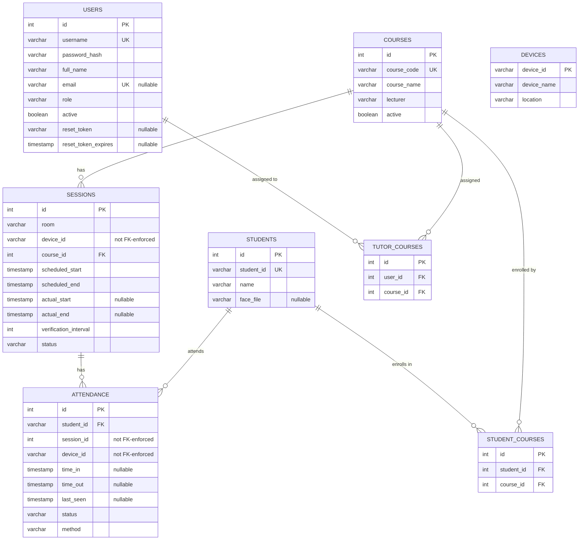

# Database Schema — Civil Engineering Attendance System

- **Database engine:** PostgreSQL
- **Database name:** `attendance_db`
- **ORM:** SQLAlchemy (models in `attendance-server/app/models/`)
- **Generated:** 2026-09-01, verified directly against the live database (`information_schema`), not just model source

---

## Entity-Relationship Diagram

---

## Tables

### `users`

Admins and tutors who log into the dashboard.

| Column | Type | Nullable | Default | Constraints |
|---|---|---|---|---|
| `id` | `integer` | No | `nextval(users_id_seq)` | **PK** |
| `username` | `varchar` | No | — | **UNIQUE** |
| `password_hash` | `varchar` | No | — | bcrypt hash |
| `full_name` | `varchar` | No | — | |
| `email` | `varchar` | Yes | — | **UNIQUE**, used for password-reset delivery |
| `role` | `varchar` | No | — | `"ADMIN"` \| `"TUTOR"` (enforced in application code, not a DB enum) |
| `active` | `boolean` | Yes | — | disabled accounts can't log in |
| `reset_token` | `varchar` | Yes | — | SHA-256 hash of the active password-reset token, cleared after use |
| `reset_token_expires` | `timestamp` | Yes | — | reset token expires 30 minutes after issue |

### `students`

The student roster, keyed by the institution's student ID (not the internal `id`).

| Column | Type | Nullable | Default | Constraints |
|---|---|---|---|---|
| `id` | `integer` | No | `nextval(students_id_seq)` | **PK** |
| `student_id` | `varchar(20)` | No | — | **UNIQUE**, institutional ID, referenced by `attendance.student_id` |
| `name` | `varchar(100)` | No | — | |
| `face_file` | `varchar(255)` | Yes | — | filename of the enrolled face image used for recognition; `NULL` = not enrolled |

### `courses`

| Column | Type | Nullable | Default | Constraints |
|---|---|---|---|---|
| `id` | `integer` | No | `nextval(courses_id_seq)` | **PK** |
| `course_code` | `varchar` | No | — | **UNIQUE** |
| `course_name` | `varchar` | No | — | |
| `lecturer` | `varchar` | No | — | free-text lecturer name |
| `active` | `boolean` | Yes | — | inactive courses can't have new sessions created |

### `devices`

Catalog of camera/recognition terminals. **Currently empty in production** — nothing else in the schema has an enforced foreign key into it (see Notes below).

| Column | Type | Nullable | Default | Constraints |
|---|---|---|---|---|
| `device_id` | `varchar(20)` | No | — | **PK**, e.g. `"CAMERA-01"` |
| `device_name` | `varchar(100)` | No | — | |
| `location` | `varchar(100)` | No | — | |

### `sessions`

A scheduled or in-progress class meeting for a course.

| Column | Type | Nullable | Default | Constraints |
|---|---|---|---|---|
| `id` | `integer` | No | `nextval(sessions_id_seq)` | **PK** |
| `course_id` | `integer` | No | — | **FK → courses.id** |
| `room` | `varchar(50)` | No | — | |
| `device_id` | `varchar(20)` | No | — | intended to reference `devices.device_id`; **no FK constraint** — free text, can be blank |
| `scheduled_start` | `timestamp` | No | — | |
| `scheduled_end` | `timestamp` | No | — | |
| `actual_start` | `timestamp` | Yes | — | set when tutor clicks "Start" |
| `actual_end` | `timestamp` | Yes | — | set when tutor clicks "Finish" |
| `verification_interval` | `integer` | Yes | `30` | seconds between re-verification checks |
| `status` | `varchar(20)` | Yes | `"SCHEDULED"` | `SCHEDULED` → `RUNNING` → `FINISHED` |

### `attendance`

One row per student per session, tracking presence over time.

| Column | Type | Nullable | Default | Constraints |
|---|---|---|---|---|
| `id` | `integer` | No | `nextval(attendance_id_seq)` | **PK** |
| `student_id` | `varchar(20)` | No | — | **FK → students.student_id** |
| `session_id` | `integer` | No | — | intended to reference `sessions.id`; **no FK constraint** in the live database |
| `device_id` | `varchar(20)` | No | — | recording device; **no FK constraint** |
| `time_in` | `timestamp` | Yes | — | first successful face recognition |
| `last_seen` | `timestamp` | Yes | — | most recent successful recognition |
| `time_out` | `timestamp` | Yes | — | set when the student disappears / session ends |
| `status` | `varchar(20)` | Yes | `"ACTIVE"` | `ACTIVE` \| `CHECKED_OUT` \| `COMPLETED` \| `ABSENT` |
| `method` | `varchar(20)` | Yes | `"Face"` | recognition method used |

### `student_courses`

Enrollment join table — which students are enrolled in which courses.

| Column | Type | Nullable | Default | Constraints |
|---|---|---|---|---|
| `id` | `integer` | No | `nextval(...)` | **PK** |
| `student_id` | `integer` | No | — | **FK → students.id** |
| `course_id` | `integer` | No | — | **FK → courses.id** |

**UNIQUE** `(student_id, course_id)` — a student can only be enrolled in a course once.

### `tutor_courses`

Assignment join table — which tutors (users) are assigned to which courses.

| Column | Type | Nullable | Default | Constraints |
|---|---|---|---|---|
| `id` | `integer` | No | `nextval(...)` | **PK** |
| `user_id` | `integer` | No | — | **FK → users.id** |
| `course_id` | `integer` | No | — | **FK → courses.id** |

**UNIQUE** `(user_id, course_id)` — a tutor can only be assigned to a course once.

---

## Relationship summary

| Relationship | Cardinality |
|---|---|
| `courses` → `sessions` | one course has many sessions |
| `sessions` → `attendance` | one session has many attendance records (not FK-enforced) |
| `students` → `attendance` | one student has many attendance records |
| `students` ↔ `courses` | many-to-many via `student_courses` |
| `users` (tutors) ↔ `courses` | many-to-many via `tutor_courses` |
| `devices` ↔ `sessions` / `attendance` | conceptual only — `device_id` is a plain string on both tables, not a real foreign key, and the `devices` table itself is currently empty |

---

## Notes and known gaps

These reflect the **actual state of the live database**, not just the model definitions — a couple of foreign keys declared in the SQLAlchemy models (`app/models/attendance.py`) are missing from the live table because this project uses `Base.metadata.create_all()` with no migration tool (e.g. Alembic): it only creates tables that don't exist yet, it never alters columns or constraints on tables that already exist. Anything added after the tables were first created — including the two items below and the `users.email` / `reset_token` / `reset_token_expires` columns — had to be applied by hand with `ALTER TABLE`.

- **`attendance.session_id` has no foreign key** to `sessions.id`, even though the model declares one.
- **`sessions.device_id` and `attendance.device_id` are plain strings**, not foreign keys to `devices.device_id`. Nothing stops a session from being created with a blank or nonexistent device ID, or a device ID that doesn't match what a physical recognition terminal is configured to poll for.
- **`devices` has no rows** in the current database — the camera/terminal catalog it's meant to hold has never been populated, and the "Camera" field on the session-creation form (`dashboard/src/pages/Sessions.js`) is a free-text input rather than a dropdown validated against it.
- **`role` on `users`** is a free-text column, not a database-level enum — `"ADMIN"` / `"TUTOR"` is enforced only in application code (`app/api/*.py`).

If you want these tightened up (real FKs, a `devices`-backed dropdown, an actual `role` enum), that's a schema migration + form change, not just a documentation fix — let me know and I can put together a plan.
